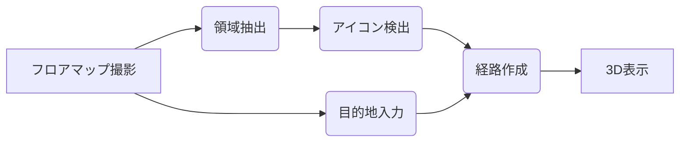

# 3DIndoorMaps
## 概要
  屋内ナビゲーションアプリのソースコードの一部
  - サーバ(XMAPP)
    - phpMyAdmin + MySQL + Apache

## フロー

```mermaid
graph LR
A[フロアマップ撮影] --> B(目的地入力)
A --> C(領域抽出)
C --> F(アイコン検出)
F --> D(経路作成)
B --> D
D --> E[3D表示]
```

